  

<table align="center" width="100%">
<tr>
<td width="5%"></td>
<td align="center" width="44%">
  
  
</td>
<td width="2%"></td>
<td align="center" width="44%">
  
  
</td>
<td width="5%"></td>
</tr>
<tr>
<td></td>
<td align="center" colspan="3">
  <h3 style="color: #ff69b4;">🔥 Contribution Streak</h3>
  
</td>
<td></td>
</tr>
</table>

---

### 📈 Activity Graph

