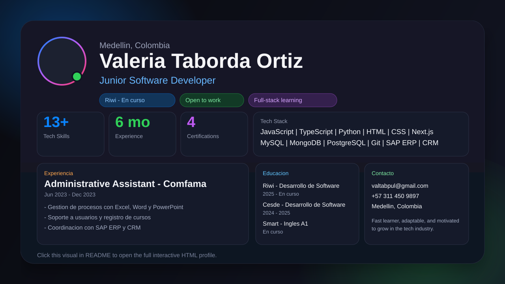

# Hola, soy Valeria Taborda Ortiz

Junior Software Developer from Medellin, Colombia.

  

  <a href="https://valtabpul.github.io/valeria-github-profile.html">Abrir perfil HTML completo</a>

## Sobre mi

- Actualmente estudiando Desarrollo de Software en Riwi
- Enfocada en Full-Stack Development
- Aprendiendo TypeScript, Next.js y APIs REST
- Open to work

## Stats rapidas

- Tech Skills: 13+
- Experience: 6 meses
- Certifications: 4

## Experiencia

### Administrative Assistant - Comfama

- Fecha: Jun 2023 - Dec 2023
- Gestion de procesos con Excel, Word y PowerPoint
- Soporte a usuarios y registro de cursos
- Control de inventario y recursos
- Coordinacion con SAP ERP y CRM

## Educacion

- Riwi - Desarrollo de Software (2025 - En curso)
- Cesde - Desarrollo de Software (2024 - 2025)
- Cesde - Asistente Administrativo (2022 - 2023)
- Smart - Ingles A1 (En curso)

## Soft Skills

- Adaptabilidad
- Trabajo en equipo
- Resolucion de problemas
- Organizacion
- Aprendizaje rapido
- Proactividad

## Actualmente aprendiendo

- TypeScript: 72%
- Next.js: 58%
- REST APIs: 65%
- Databases: 80%
- English: A1
